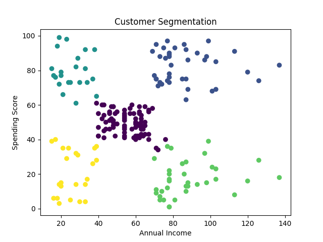
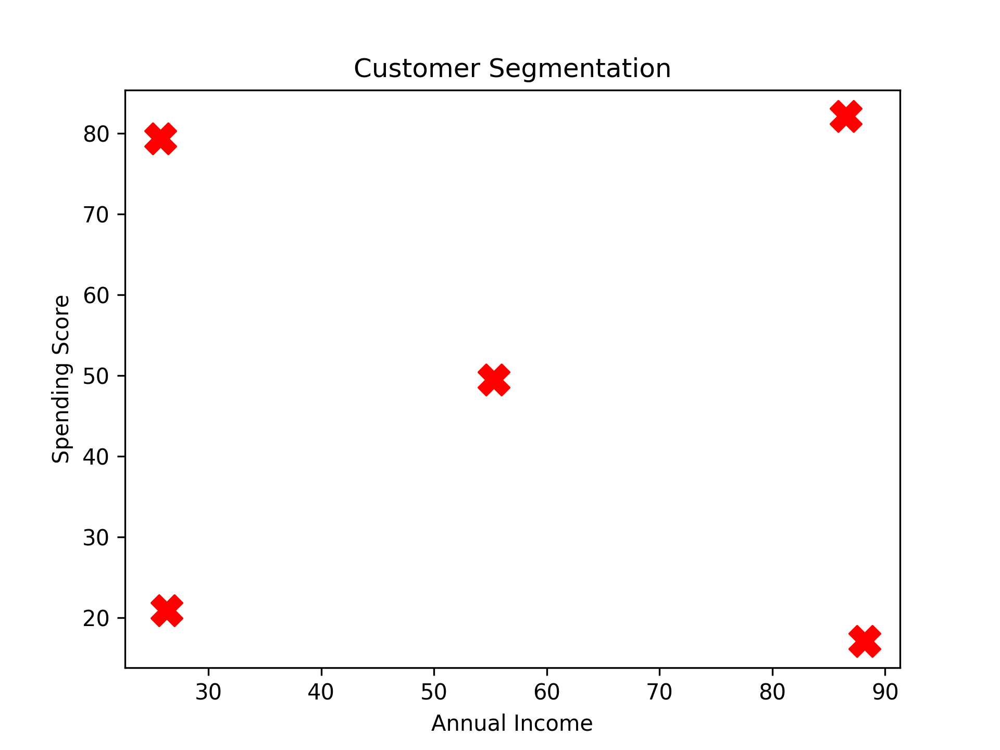

# Customer Segmentation Project

This project segments mall customers based on their **annual income** and **spending score** using clustering techniques.

## Description
The goal of this project is to identify different groups of customers based on their spending behavior. By analyzing customer data, businesses can tailor marketing strategies and improve customer satisfaction.

## Dataset
The dataset `Mall_Customers.csv` contains the following columns:
- **CustomerID**: Unique identifier for each customer
- **Gender**: Male/Female
- **Age**: Age of the customer
- **Annual Income (k$)**: Annual income in thousand dollars
- **Spending Score (1-100)**: Score assigned by the mall based on spending behavior

## Visualizations
### Customer Segmentation Scatter Plot

### Cluster Centers

## Tools and Libraries Used
- **Python**  
- **Pandas** – for data handling  
- **Scikit-learn** – for K-Means clustering  
- **Matplotlib** – for visualizations  
